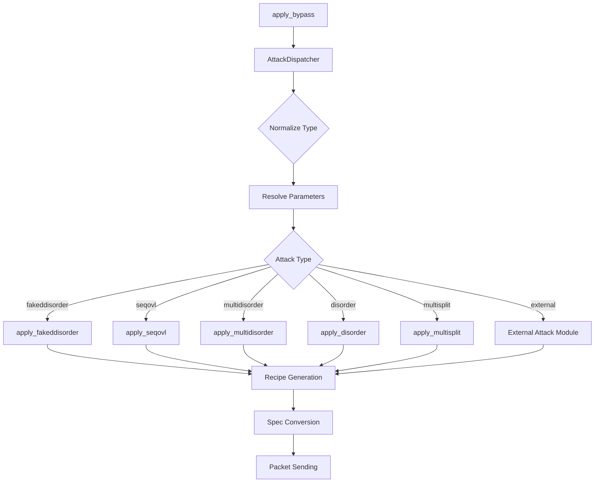

# Дизайн: Рефакторинг Диспетчеризации Атак DPI

## 🏗️ Архитектурный Обзор

### Текущая Архитектура (❌ Проблемная)
```
CLI/UnifiedStrategyLoader → base_engine.apply_bypass() → primitives.apply_fakeddisorder()
                                     ↓
                            ВСЕ АТАКИ ИДУТ ЧЕРЕЗ ОДИН МЕТОД!
```

### Целевая Архитектура (✅ Правильная)
```
CLI/UnifiedStrategyLoader → AttackDispatcher → AttackRegistry → Specific Attack Modules
                                ↓                    ↓
                         Route by type        core/bypass/attacks/*
                                ↓                    ↓
                         primitives.apply_*()   Specialized Attacks
```

## 🎯 Ключевые Компоненты

### 1. AttackDispatcher (Новый)
**Расположение**: `core/bypass/engine/attack_dispatcher.py`

**Ответственность**:
- Правильная маршрутизация каждого типа атаки
- Нормализация параметров
- Разрешение специальных значений (`cipher`, `sni`, `midsld`)

```python
class AttackDispatcher:
    def __init__(self, techniques: BypassTechniques, attack_registry: AttackRegistry):
        self.techniques = techniques
        self.registry = attack_registry
    
    def dispatch_attack(self, task_type: str, params: Dict, payload: bytes, packet_info: Dict) -> List[Tuple]:
        """Диспетчеризует атаку к правильному обработчику."""
        # Нормализация типа
        normalized_type = self._normalize_attack_type(task_type)
        
        # Разрешение параметров
        resolved_params = self._resolve_parameters(params, payload, normalized_type)
        
        # Диспетчеризация
        return self._execute_attack(normalized_type, resolved_params, payload, packet_info)
```

### 2. AttackRegistry (Новый)
**Расположение**: `core/bypass/attacks/attack_registry.py`

**Ответственность**:
- Реестр всех доступных атак
- Метаданные о параметрах каждой атаки
- Валидация параметров

```python
class AttackRegistry:
    def __init__(self):
        self.attacks = {}
        self._register_builtin_attacks()
        self._register_external_attacks()
    
    def register_attack(self, attack_type: str, handler: callable, metadata: AttackMetadata):
        """Регистрирует новую атаку."""
        
    def get_attack_handler(self, attack_type: str) -> callable:
        """Возвращает обработчик для типа атаки."""
        
    def validate_parameters(self, attack_type: str, params: Dict) -> ValidationResult:
        """Валидирует параметры для типа атаки."""
```

### 3. AttackMetadata (Новый)
**Расположение**: `core/bypass/attacks/metadata.py`

```python
@dataclass
class AttackMetadata:
    name: str
    description: str
    required_params: List[str]
    optional_params: Dict[str, Any]
    aliases: List[str]
    category: str  # "split", "disorder", "fake", "race", etc.
    
class AttackCategories:
    SPLIT = "split"
    DISORDER = "disorder" 
    FAKE = "fake"
    RACE = "race"
    OVERLAP = "overlap"
    FRAGMENT = "fragment"
```

## 🔧 Детальный Дизайн Компонентов

### Рефакторинг base_engine.py

#### Текущий Код (❌)
```python
if task_type in ("fakeddisorder", "multidisorder", "disorder", "disorder2", "seqovl"):
    recipe = self.techniques.apply_fakeddisorder(payload, split_pos=int(params.get("split_pos", 76)), ...)
```

#### Новый Код (✅)
```python
def apply_bypass(self, packet, w, strategy_task: Dict, forced=True):
    """ИСПРАВЛЕННАЯ версия с правильной диспетчеризацией."""
    
    # Инициализация диспетчера (если еще не создан)
    if not hasattr(self, '_attack_dispatcher'):
        self._attack_dispatcher = AttackDispatcher(self.techniques, AttackRegistry())
    
    # Извлечение параметров
    task_type = strategy_task.get("type", "fakeddisorder")
    params = strategy_task.get("params", {})
    payload = bytes(packet.payload or b"")
    
    # Информация о пакете для контекста
    packet_info = {
        'src_addr': packet.src_addr,
        'dst_addr': packet.dst_addr,
        'src_port': packet.src_port,
        'dst_port': packet.dst_port
    }
    
    try:
        # ✅ ПРАВИЛЬНАЯ ДИСПЕТЧЕРИЗАЦИЯ
        recipe = self._attack_dispatcher.dispatch_attack(task_type, params, payload, packet_info)
        
        if not recipe:
            self.logger.warning(f"No recipe generated for attack type '{task_type}', forwarding original")
            w.send(packet)
            return
            
        # Конвертация рецепта в спецификации
        specs = self._recipe_to_specs(recipe, payload)
        
        # Отправка пакетов
        self._send_packet_sequence(specs, packet, w, strategy_task)
        
    except Exception as e:
        self.logger.error(f"Attack dispatch failed for '{task_type}': {e}")
        w.send(packet)
```

### Расширение primitives.py

#### Добавление Недостающих Методов
```python
class BypassTechniques:
    
    @staticmethod
    def apply_disorder(payload: bytes, split_pos: int, ack_first: bool = False) -> List[Tuple]:
        """Простой disorder без фейкового пакета."""
        if len(payload) < 2:
            return [(payload, 0, {"is_fake": False, "tcp_flags": 0x18})]
            
        sp = max(1, min(int(split_pos), len(payload) - 1))
        part1 = payload[:sp]
        part2 = payload[sp:]
        
        first_flags = 0x10 if ack_first else 0x18
        
        return [
            (part2, sp, {"is_fake": False, "tcp_flags": first_flags}),
            (part1, 0, {"is_fake": False, "tcp_flags": 0x18}),
        ]
    
    @staticmethod 
    def apply_seqovl(payload: bytes, split_pos: int, overlap_size: int, fake_ttl: int = 3, fooling_methods: List[str] = None) -> List[Tuple]:
        """Sequence overlap атака."""
        if len(payload) < 2:
            return [(payload, 0, {"is_fake": False, "tcp_flags": 0x18})]
            
        sp = max(1, min(int(split_pos), len(payload) - 1))
        ovl = min(overlap_size, sp)
        
        # Фейковый пакет с перекрытием
        fake_part = payload[sp-ovl:sp] if ovl > 0 else payload[:1]
        
        # Реальный полный пакет
        real_part = payload
        
        fake_opts = {
            "is_fake": True, 
            "tcp_flags": 0x18, 
            "ttl": fake_ttl,
            "fooling": fooling_methods or ["badsum"]
        }
        real_opts = {"is_fake": False, "tcp_flags": 0x18}
        
        return [
            (fake_part, sp-ovl, fake_opts),
            (real_part, 0, real_opts),
        ]
```

### Интеграция с Модулями core/bypass/attacks/

#### Анализ Существующих Модулей
Сначала нужно проанализировать, что уже есть в `core/bypass/attacks/`:

```python
# Скрипт для анализа существующих атак
def analyze_existing_attacks():
    attacks_dir = Path("core/bypass/attacks")
    existing_attacks = {}
    
    for py_file in attacks_dir.glob("*.py"):
        if py_file.name == "__init__.py":
            continue
            
        # Анализ модуля
        module_info = analyze_attack_module(py_file)
        existing_attacks[py_file.stem] = module_info
    
    return existing_attacks
```

#### Интеграция Существующих Атак
```python
class AttackRegistry:
    def _register_external_attacks(self):
        """Регистрирует атаки из core/bypass/attacks/"""
        attacks_dir = Path("core/bypass/attacks")
        
        for module_file in attacks_dir.glob("*.py"):
            if module_file.name.startswith("_"):
                continue
                
            try:
                module = importlib.import_module(f"core.bypass.attacks.{module_file.stem}")
                
                # Поиск классов атак
                for name, obj in inspect.getmembers(module, inspect.isclass):
                    if hasattr(obj, 'attack_type') and hasattr(obj, 'execute'):
                        self._register_attack_class(obj)
                        
            except Exception as e:
                logger.warning(f"Failed to load attack module {module_file}: {e}")
```

## 📊 Схема Диспетчеризации

### Алгоритм Диспетчеризации


### Таблица Маппинга Атак
| Тип Атаки | Метод | Обязательные Параметры | Опциональные |
|-----------|-------|----------------------|-------------|
| `fakeddisorder` | `apply_fakeddisorder` | `split_pos` | `fooling`, `ttl` |
| `seqovl` | `apply_seqovl` | `split_pos`, `overlap_size` | `fooling`, `ttl` |
| `multidisorder` | `apply_multidisorder` | `positions` | `fooling`, `ttl` |
| `disorder` | `apply_disorder` | `split_pos` | `ack_first` |
| `disorder2` | `apply_disorder` | `split_pos` | `ack_first=True` |
| `multisplit` | `apply_multisplit` | `positions` | `fooling` |
| `split` | `apply_multisplit` | `split_pos` | `fooling` |
| `fake` | `apply_fake_packet_race` | `ttl` | `fooling` |

## 🔄 Миграционная Стратегия

### Этап 1: Подготовка
1. Создать новые компоненты (`AttackDispatcher`, `AttackRegistry`)
2. Расширить `primitives.py` недостающими методами
3. Создать тесты для новых компонентов

### Этап 2: Интеграция
1. Интегрировать `AttackDispatcher` в `base_engine.py`
2. Заменить единый блок диспетчеризации на вызов диспетчера
3. Обновить обработку ошибок

### Этап 3: Валидация
1. Запустить все существующие тесты
2. Проверить производительность
3. Валидировать обратную совместимость

### Этап 4: Очистка
1. Удалить дублирующий код
2. Обновить документацию
3. Создать примеры использования

## 🧪 Стратегия Тестирования

### Модульные Тесты
```python
class TestAttackDispatcher:
    def test_fakeddisorder_dispatch(self):
        """Тест диспетчеризации fakeddisorder."""
        dispatcher = AttackDispatcher(techniques, registry)
        
        recipe = dispatcher.dispatch_attack(
            "fakeddisorder", 
            {"split_pos": 3, "ttl": 3}, 
            b"test_payload",
            {}
        )
        
        assert len(recipe) == 3  # fake + 2 real parts
        assert recipe[0][2]["is_fake"] == True
        
    def test_seqovl_dispatch(self):
        """Тест диспетчеризации seqovl."""
        dispatcher = AttackDispatcher(techniques, registry)
        
        recipe = dispatcher.dispatch_attack(
            "seqovl",
            {"split_pos": 5, "overlap_size": 20, "ttl": 3},
            b"test_payload_longer",
            {}
        )
        
        assert len(recipe) == 2  # fake overlap + real full
        assert recipe[0][2]["is_fake"] == True
        assert recipe[1][2]["is_fake"] == False
```

### Интеграционные Тесты
```python
class TestFullAttackFlow:
    def test_end_to_end_fakeddisorder(self):
        """Тест полного цикла fakeddisorder атаки."""
        engine = WindowsBypassEngine(config)
        packet = create_test_packet()
        strategy = {"type": "fakeddisorder", "params": {"split_pos": 3}}
        
        with patch('pydivert.WinDivert') as mock_divert:
            engine.apply_bypass(packet, mock_divert, strategy)
            
        # Проверяем, что отправлено 3 пакета
        assert mock_divert.send.call_count == 3
```

## 📈 Метрики и Мониторинг

### Ключевые Метрики
- Время диспетчеризации атаки
- Успешность выполнения каждого типа атаки
- Использование различных типов атак
- Ошибки диспетчеризации

### Логирование
```python
class AttackDispatcher:
    def dispatch_attack(self, task_type: str, params: Dict, payload: bytes, packet_info: Dict):
        start_time = time.time()
        
        try:
            result = self._execute_attack(...)
            
            self.logger.info(f"✅ Attack '{task_type}' dispatched successfully in {time.time() - start_time:.3f}s")
            return result
            
        except Exception as e:
            self.logger.error(f"❌ Attack '{task_type}' dispatch failed: {e}")
            raise
```

## 🔒 Безопасность и Валидация

### Валидация Параметров
```python
class ParameterValidator:
    def validate_attack_params(self, attack_type: str, params: Dict) -> ValidationResult:
        """Валидирует параметры атаки."""
        metadata = self.registry.get_metadata(attack_type)
        
        # Проверка обязательных параметров
        for required_param in metadata.required_params:
            if required_param not in params:
                return ValidationResult(False, f"Missing required parameter: {required_param}")
        
        # Валидация значений
        return self._validate_parameter_values(attack_type, params)
```

### Безопасность
- Валидация всех входных параметров
- Ограничение размеров payload
- Проверка корректности split_pos значений
- Защита от инъекций в параметрах