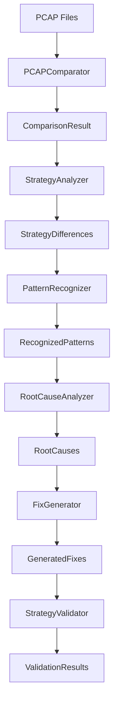

# Developer Guide

## Table of Contents

1. [Development Setup](#development-setup)
2. [Architecture Overview](#architecture-overview)
3. [Core Components](#core-components)
4. [Extending the System](#extending-the-system)
5. [Testing Guidelines](#testing-guidelines)
6. [Contributing](#contributing)
7. [API Reference](#api-reference)

## Development Setup

### Prerequisites

- Python 3.8+
- Git
- Virtual environment tool (venv, conda, etc.)
- IDE with Python support (VS Code, PyCharm, etc.)

### Environment Setup

1. **Clone Repository**
   ```bash
   git clone <repository-url>
   cd recon-pcap-analysis
   ```

2. **Create Virtual Environment**
   ```bash
   python -m venv venv
   source venv/bin/activate  # Linux/Mac
   # or
   venv\Scripts\activate     # Windows
   ```

3. **Install Dependencies**
   ```bash
   pip install -r requirements-dev.txt
   ```

4. **Install Pre-commit Hooks**
   ```bash
   pre-commit install
   ```

5. **Run Tests**
   ```bash
   pytest tests/
   ```

### Development Tools

**Code Quality:**
- `black` - Code formatting
- `isort` - Import sorting
- `flake8` - Linting
- `mypy` - Type checking
- `pre-commit` - Git hooks

**Testing:**
- `pytest` - Test framework
- `pytest-cov` - Coverage reporting
- `pytest-mock` - Mocking utilities
- `pytest-asyncio` - Async testing

**Documentation:**
- `sphinx` - Documentation generation
- `mkdocs` - Alternative documentation
- `pydoc` - API documentation

### Project Structure

```
recon/core/pcap_analysis/
├── __init__.py
├── cli.py                    # Command-line interface
├── pcap_comparator.py       # Core comparison logic
├── strategy_analyzer.py     # Strategy analysis
├── packet_sequence_analyzer.py  # Packet sequence analysis
├── difference_detector.py   # Difference detection
├── pattern_recognizer.py    # Pattern recognition
├── root_cause_analyzer.py   # Root cause analysis
├── fix_generator.py         # Fix generation
├── strategy_validator.py    # Strategy validation
├── regression_tester.py     # Regression testing
├── analysis_reporter.py     # Report generation
├── error_handling.py        # Error handling
├── logging_config.py        # Logging configuration
├── models/                  # Data models
│   ├── __init__.py
│   ├── packet_info.py
│   ├── strategy_config.py
│   ├── comparison_result.py
│   └── critical_difference.py
├── utils/                   # Utility functions
│   ├── __init__.py
│   ├── pcap_utils.py
│   ├── network_utils.py
│   └── validation_utils.py
├── tests/                   # Test files
│   ├── __init__.py
│   ├── test_pcap_comparator.py
│   ├── test_strategy_analyzer.py
│   └── ...
└── docs/                    # Documentation
    ├── README.md
    ├── architecture.md
    ├── user_guide.md
    └── developer_guide.md
```

## Architecture Overview

### Design Principles

1. **Modularity**: Each component has a single responsibility
2. **Extensibility**: Easy to add new analyzers and generators
3. **Testability**: All components are unit testable
4. **Performance**: Optimized for large PCAP files
5. **Reliability**: Comprehensive error handling and recovery

### Component Interaction

```python
# Example component interaction
from core.pcap_analysis import PCAPComparator, StrategyAnalyzer, FixGenerator

# Initialize components
comparator = PCAPComparator()
analyzer = StrategyAnalyzer()
generator = FixGenerator()

# Analysis pipeline
comparison_result = comparator.compare_pcaps("recon.pcap", "zapret.pcap")
strategy_diff = analyzer.analyze_differences(comparison_result)
fixes = generator.generate_fixes(strategy_diff)
```

### Data Flow



## Core Components

### 1. PCAPComparator

**Purpose**: Compare PCAP files at the packet level

**Key Methods**:
```python
class PCAPComparator:
    def compare_pcaps(self, recon_pcap: str, zapret_pcap: str) -> ComparisonResult:
        """Compare two PCAP files and return detailed comparison results."""
        
    def extract_packets(self, pcap_file: str) -> List[PacketInfo]:
        """Extract and parse packets from PCAP file."""
        
    def align_sequences(self, recon_packets: List[PacketInfo], 
                       zapret_packets: List[PacketInfo]) -> AlignmentResult:
        """Align packet sequences for comparison."""
```

**Extension Points**:
```python
class CustomPCAPComparator(PCAPComparator):
    def custom_packet_filter(self, packet: PacketInfo) -> bool:
        """Custom packet filtering logic."""
        return packet.protocol == "TLS" and packet.port == 443
        
    def custom_comparison_metric(self, p1: PacketInfo, p2: PacketInfo) -> float:
        """Custom packet comparison metric."""
        return calculate_similarity(p1, p2)
```

### 2. StrategyAnalyzer

**Purpose**: Analyze DPI bypass strategies

**Key Methods**:
```python
class StrategyAnalyzer:
    def analyze_strategy_from_pcap(self, pcap_file: str) -> StrategyConfig:
        """Extract strategy configuration from PCAP patterns."""
        
    def compare_strategies(self, recon_strategy: StrategyConfig, 
                          zapret_strategy: StrategyConfig) -> StrategyDifferences:
        """Compare two strategy configurations."""
        
    def validate_strategy_parameters(self, strategy: StrategyConfig) -> ValidationResult:
        """Validate strategy parameter correctness."""
```

**Extension Example**:
```python
class CustomStrategyAnalyzer(StrategyAnalyzer):
    def analyze_custom_strategy(self, packets: List[PacketInfo]) -> CustomStrategyConfig:
        """Analyze custom DPI bypass strategy."""
        # Custom analysis logic
        pass
```

### 3. FixGenerator

**Purpose**: Generate automated code fixes

**Key Methods**:
```python
class FixGenerator:
    def generate_fixes(self, root_causes: List[RootCause]) -> List[CodeFix]:
        """Generate code fixes for identified root causes."""
        
    def create_test_cases(self, fix: CodeFix) -> List[TestCase]:
        """Create test cases for generated fixes."""
        
    def validate_fix_safety(self, fix: CodeFix) -> SafetyAssessment:
        """Assess the safety of applying a fix."""
```

**Custom Fix Generator**:
```python
class CustomFixGenerator(FixGenerator):
    def generate_custom_fix(self, custom_issue: CustomIssue) -> CustomFix:
        """Generate fixes for custom issues."""
        return CustomFix(
            type="custom_parameter_fix",
            description="Fix custom parameter issue",
            code_changes=self.generate_custom_code_changes(custom_issue)
        )
```

## Extending the System

### Adding New Analyzers

1. **Create Analyzer Class**
   ```python
   from core.pcap_analysis.base import BaseAnalyzer
   
   class CustomAnalyzer(BaseAnalyzer):
       def __init__(self, config: Dict[str, Any]):
           super().__init__(config)
           self.custom_param = config.get('custom_param', 'default')
           
       def analyze(self, data: AnalysisData) -> AnalysisResult:
           """Implement custom analysis logic."""
           # Your analysis logic here
           return AnalysisResult(
               findings=self.find_custom_patterns(data),
               confidence=self.calculate_confidence(),
               metadata=self.get_analysis_metadata()
           )
           
       def find_custom_patterns(self, data: AnalysisData) -> List[Finding]:
           """Custom pattern finding logic."""
           patterns = []
           # Implementation
           return patterns
   ```

2. **Register Analyzer**
   ```python
   # In __init__.py or registry module
   from core.pcap_analysis.registry import AnalyzerRegistry
   
   AnalyzerRegistry.register('custom_analyzer', CustomAnalyzer)
   ```

3. **Use in Configuration**
   ```json
   {
     "analyzers": [
       {
         "type": "custom_analyzer",
         "config": {
           "custom_param": "custom_value"
         }
       }
     ]
   }
   ```

### Adding New Fix Generators

1. **Create Fix Generator**
   ```python
   from core.pcap_analysis.base import BaseFixGenerator
   
   class CustomFixGenerator(BaseFixGenerator):
       def can_handle(self, root_cause: RootCause) -> bool:
           """Check if this generator can handle the root cause."""
           return root_cause.type == 'custom_issue'
           
       def generate_fix(self, root_cause: RootCause) -> CodeFix:
           """Generate fix for custom issue."""
           return CodeFix(
               id=f"custom_fix_{uuid.uuid4()}",
               type="custom_fix",
               description=f"Fix for {root_cause.description}",
               file_path=self.determine_target_file(root_cause),
               changes=self.generate_code_changes(root_cause),
               test_cases=self.generate_test_cases(root_cause)
           )
   ```

2. **Register Fix Generator**
   ```python
   from core.pcap_analysis.registry import FixGeneratorRegistry
   
   FixGeneratorRegistry.register('custom_fix_generator', CustomFixGenerator)
   ```

### Adding New Validators

1. **Create Validator**
   ```python
   from core.pcap_analysis.base import BaseValidator
   
   class CustomValidator(BaseValidator):
       def validate(self, fix: CodeFix, context: ValidationContext) -> ValidationResult:
           """Validate custom fix."""
           # Custom validation logic
           success = self.run_custom_tests(fix)
           
           return ValidationResult(
               success=success,
               confidence=self.calculate_confidence(fix),
               metrics=self.collect_metrics(fix),
               errors=self.get_validation_errors(fix) if not success else []
           )
   ```

### Adding New Data Models

1. **Create Model**
   ```python
   from dataclasses import dataclass
   from typing import Optional, List, Dict, Any
   
   @dataclass
   class CustomAnalysisResult:
       """Custom analysis result model."""
       custom_metric: float
       custom_findings: List[str]
       custom_metadata: Dict[str, Any]
       confidence: float = 0.0
       
       def to_dict(self) -> Dict[str, Any]:
           """Convert to dictionary for serialization."""
           return {
               'custom_metric': self.custom_metric,
               'custom_findings': self.custom_findings,
               'custom_metadata': self.custom_metadata,
               'confidence': self.confidence
           }
           
       @classmethod
       def from_dict(cls, data: Dict[str, Any]) -> 'CustomAnalysisResult':
           """Create from dictionary."""
           return cls(
               custom_metric=data['custom_metric'],
               custom_findings=data['custom_findings'],
               custom_metadata=data['custom_metadata'],
               confidence=data.get('confidence', 0.0)
           )
   ```

## Testing Guidelines

### Unit Testing

1. **Test Structure**
   ```python
   import pytest
   from unittest.mock import Mock, patch
   from core.pcap_analysis import PCAPComparator
   
   class TestPCAPComparator:
       def setup_method(self):
           """Setup test fixtures."""
           self.comparator = PCAPComparator()
           self.mock_packets = self.create_mock_packets()
           
       def test_compare_pcaps_success(self):
           """Test successful PCAP comparison."""
           # Arrange
           recon_pcap = "test_recon.pcap"
           zapret_pcap = "test_zapret.pcap"
           
           # Act
           result = self.comparator.compare_pcaps(recon_pcap, zapret_pcap)
           
           # Assert
           assert result is not None
           assert result.similarity_score >= 0.0
           assert len(result.differences) >= 0
           
       def test_compare_pcaps_file_not_found(self):
           """Test PCAP comparison with missing file."""
           with pytest.raises(FileNotFoundError):
               self.comparator.compare_pcaps("missing.pcap", "zapret.pcap")
               
       @patch('core.pcap_analysis.pcap_comparator.scapy.rdpcap')
       def test_extract_packets_mocked(self, mock_rdpcap):
           """Test packet extraction with mocked scapy."""
           # Setup mock
           mock_rdpcap.return_value = self.mock_packets
           
           # Test
           packets = self.comparator.extract_packets("test.pcap")
           
           # Verify
           assert len(packets) == len(self.mock_packets)
           mock_rdpcap.assert_called_once_with("test.pcap")
   ```

2. **Integration Testing**
   ```python
   class TestPCAPAnalysisIntegration:
       def test_full_analysis_pipeline(self):
           """Test complete analysis pipeline."""
           # Setup
           recon_pcap = "tests/data/recon_test.pcap"
           zapret_pcap = "tests/data/zapret_test.pcap"
           
           # Run pipeline
           comparator = PCAPComparator()
           analyzer = StrategyAnalyzer()
           generator = FixGenerator()
           
           comparison = comparator.compare_pcaps(recon_pcap, zapret_pcap)
           differences = analyzer.analyze_differences(comparison)
           fixes = generator.generate_fixes(differences)
           
           # Verify
           assert len(fixes) > 0
           assert all(fix.type in ['parameter_change', 'sequence_fix'] for fix in fixes)
   ```

3. **Performance Testing**
   ```python
   import time
   import pytest
   
   class TestPerformance:
       @pytest.mark.performance
       def test_large_pcap_processing_time(self):
           """Test processing time for large PCAP files."""
           start_time = time.time()
           
           # Process large PCAP
           comparator = PCAPComparator()
           result = comparator.compare_pcaps("large_recon.pcap", "large_zapret.pcap")
           
           processing_time = time.time() - start_time
           
           # Should process within reasonable time
           assert processing_time < 60  # 60 seconds max
           assert result is not None
   ```

### Test Data Management

1. **Test Data Structure**
   ```
   tests/
   ├── data/
   │   ├── pcaps/
   │   │   ├── recon_test.pcap
   │   │   ├── zapret_test.pcap
   │   │   └── corrupted_test.pcap
   │   ├── configs/
   │   │   ├── test_config.json
   │   │   └── invalid_config.json
   │   └── expected_results/
   │       ├── comparison_result.json
   │       └── analysis_result.json
   ```

2. **Test Data Generation**
   ```python
   def create_test_pcap(filename: str, packet_count: int = 100):
       """Create test PCAP file with synthetic packets."""
       from scapy.all import wrpcap, IP, TCP
       
       packets = []
       for i in range(packet_count):
           packet = IP(dst="1.1.1.1")/TCP(dport=443, sport=12345+i)
           packets.append(packet)
           
       wrpcap(filename, packets)
   ```

### Continuous Integration

1. **GitHub Actions Configuration**
   ```yaml
   name: Tests
   on: [push, pull_request]
   
   jobs:
     test:
       runs-on: ubuntu-latest
       strategy:
         matrix:
           python-version: [3.8, 3.9, '3.10', 3.11]
           
       steps:
         - uses: actions/checkout@v3
         - name: Set up Python ${{ matrix.python-version }}
           uses: actions/setup-python@v3
           with:
             python-version: ${{ matrix.python-version }}
             
         - name: Install dependencies
           run: |
             python -m pip install --upgrade pip
             pip install -r requirements-dev.txt
             
         - name: Run tests
           run: |
             pytest tests/ --cov=core/pcap_analysis --cov-report=xml
             
         - name: Upload coverage
           uses: codecov/codecov-action@v3
           with:
             file: ./coverage.xml
   ```

## Contributing

### Code Style

1. **Formatting**
   ```bash
   # Format code
   black core/ tests/
   
   # Sort imports
   isort core/ tests/
   
   # Check style
   flake8 core/ tests/
   ```

2. **Type Hints**
   ```python
   from typing import List, Dict, Optional, Union
   
   def analyze_packets(packets: List[PacketInfo], 
                      config: Dict[str, Any]) -> Optional[AnalysisResult]:
       """Analyze packets with proper type hints."""
       pass
   ```

3. **Documentation**
   ```python
   def complex_function(param1: str, param2: int) -> Dict[str, Any]:
       """
       Complex function with comprehensive documentation.
       
       Args:
           param1: Description of first parameter
           param2: Description of second parameter
           
       Returns:
           Dictionary containing analysis results
           
       Raises:
           ValueError: When param1 is empty
           TypeError: When param2 is not an integer
           
       Example:
           >>> result = complex_function("test", 42)
           >>> print(result['status'])
           'success'
       """
       pass
   ```

### Pull Request Process

1. **Before Submitting**
   - Run all tests: `pytest tests/`
   - Check code style: `flake8 core/ tests/`
   - Update documentation if needed
   - Add tests for new functionality

2. **PR Description Template**
   ```markdown
   ## Description
   Brief description of changes
   
   ## Type of Change
   - [ ] Bug fix
   - [ ] New feature
   - [ ] Breaking change
   - [ ] Documentation update
   
   ## Testing
   - [ ] Unit tests added/updated
   - [ ] Integration tests added/updated
   - [ ] Manual testing completed
   
   ## Checklist
   - [ ] Code follows style guidelines
   - [ ] Self-review completed
   - [ ] Documentation updated
   - [ ] Tests pass locally
   ```

### Release Process

1. **Version Bumping**
   ```bash
   # Update version in setup.py and __init__.py
   # Create release notes
   # Tag release
   git tag -a v1.2.0 -m "Release version 1.2.0"
   git push origin v1.2.0
   ```

2. **Release Notes Template**
   ```markdown
   # Release v1.2.0
   
   ## New Features
   - Added custom analyzer support
   - Improved performance for large PCAP files
   
   ## Bug Fixes
   - Fixed memory leak in packet processing
   - Corrected TTL analysis logic
   
   ## Breaking Changes
   - Changed API for FixGenerator.generate_fixes()
   
   ## Dependencies
   - Updated scapy to 2.4.5
   - Added new dependency: numpy>=1.20.0
   ```

## API Reference

### Core Classes

#### PCAPComparator
```python
class PCAPComparator:
    def __init__(self, config: Optional[Dict[str, Any]] = None):
        """Initialize PCAP comparator with optional configuration."""
        
    def compare_pcaps(self, recon_pcap: str, zapret_pcap: str) -> ComparisonResult:
        """Compare two PCAP files and return detailed results."""
        
    def extract_packets(self, pcap_file: str, 
                       filter_expr: Optional[str] = None) -> List[PacketInfo]:
        """Extract packets from PCAP file with optional filtering."""
```

#### StrategyAnalyzer
```python
class StrategyAnalyzer:
    def analyze_strategy_from_pcap(self, pcap_file: str) -> StrategyConfig:
        """Extract strategy configuration from PCAP patterns."""
        
    def compare_strategies(self, recon_strategy: StrategyConfig, 
                          zapret_strategy: StrategyConfig) -> StrategyDifferences:
        """Compare two strategy configurations."""
```

#### FixGenerator
```python
class FixGenerator:
    def generate_fixes(self, root_causes: List[RootCause]) -> List[CodeFix]:
        """Generate code fixes for identified root causes."""
        
    def apply_fix(self, fix: CodeFix, backup_dir: str) -> ApplicationResult:
        """Apply a code fix with backup creation."""
```

### Utility Functions

```python
# PCAP utilities
def validate_pcap_file(pcap_path: str) -> bool:
    """Validate PCAP file integrity."""
    
def extract_domain_packets(pcap_path: str, domain: str) -> List[PacketInfo]:
    """Extract packets for specific domain."""
    
# Network utilities
def resolve_domain_ips(domain: str) -> List[str]:
    """Resolve domain to IP addresses."""
    
def check_connectivity(domain: str, port: int = 443) -> bool:
    """Check network connectivity to domain."""
    
# Validation utilities
def validate_strategy_config(config: StrategyConfig) -> ValidationResult:
    """Validate strategy configuration."""
    
def calculate_similarity_score(packets1: List[PacketInfo], 
                              packets2: List[PacketInfo]) -> float:
    """Calculate similarity score between packet sequences."""
```

This developer guide provides comprehensive information for extending and contributing to the PCAP analysis system. It covers all aspects from setup to advanced customization.