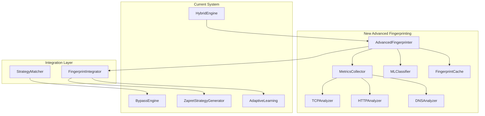

# Design Document: Advanced DPI Fingerprinting System

## Overview

Система продвинутого фингерпринтинга DPI предназначена для восстановления и улучшения возможностей анализа DPI-систем, утраченных при переходе от "навороченной" версии к текущей. Основная цель - создать ML-based систему классификации DPI с детальными метриками (20+), кэшированием результатов и интеграцией с существующей системой генерации стратегий.

Система должна быть обратно совместимой с текущей архитектурой, но значительно расширить возможности анализа DPI-поведения для более точной генерации стратегий обхода.

## Architecture

### High-Level Architecture



### Component Interaction Flow

1. **HybridEngine** запрашивает фингерпринт для целевого домена/IP
2. **AdvancedFingerprinter** проверяет кэш, если нет - запускает анализ
3. **MetricsCollector** собирает данные через специализированные анализаторы
4. **MLClassifier** классифицирует тип DPI на основе собранных метрик
5. **FingerprintCache** сохраняет результат с TTL
6. **FingerprintIntegrator** передает данные в генератор стратегий
7. **StrategyMatcher** адаптирует стратегии под конкретный тип DPI

## Components and Interfaces

### 1. AdvancedFingerprinter (Core Component)

```python
class AdvancedFingerprinter:
    """
    Главный компонент системы фингерпринтинга.
    Координирует работу всех анализаторов и ML-классификатора.
    """
    
    def __init__(self, cache_ttl: int = 3600, enable_ml: bool = True):
        self.metrics_collector = MetricsCollector()
        self.ml_classifier = MLClassifier() if enable_ml else None
        self.cache = FingerprintCache(ttl=cache_ttl)
        self.tcp_analyzer = TCPAnalyzer()
        self.http_analyzer = HTTPAnalyzer()
        self.dns_analyzer = DNSAnalyzer()
    
    async def fingerprint_target(
        self, 
        target: str, 
        port: int = 443,
        force_refresh: bool = False
    ) -> DPIFingerprint:
        """Создает детальный фингерпринт DPI для ��ели."""
        pass
    
    def get_cached_fingerprint(self, target: str) -> Optional[DPIFingerprint]:
        """Получает кэшированный фингерпринт."""
        pass
    
    def invalidate_cache(self, target: str = None):
        """Инвалидирует кэш для цели или весь кэш."""
        pass
```

### 2. MetricsCollector (Data Collection)

```python
class MetricsCollector:
    """
    Собирает 20+ детальных метрик поведения DPI.
    Координирует работу специализированных анализаторов.
    """
    
    async def collect_comprehensive_metrics(
        self, 
        target: str, 
        port: int
    ) -> Dict[str, Any]:
        """Собирает все доступные метрики DPI."""
        pass
    
    def _collect_timing_metrics(self, target: str, port: int) -> Dict:
        """Метрики времени отклика и задержек."""
        pass
    
    def _collect_packet_behavior_metrics(self, target: str, port: int) -> Dict:
        """Метрики поведения пакетов (RST, timeout, etc.)."""
        pass
    
    def _collect_protocol_metrics(self, target: str, port: int) -> Dict:
        """Метрики протокольного поведения."""
        pass
```

### 3. MLClassifier (Machine Learning)

```python
from sklearn.ensemble import RandomForestClassifier
from sklearn.model_selection import train_test_split
import joblib

class MLClassifier:
    """
    ML-классификатор типов DPI на основе sklearn RandomForest.
    Обучается на собранных метриках и классифицирует DPI-системы.
    """
    
    def __init__(self, model_path: str = "dpi_classifier.joblib"):
        self.model = None
        self.model_path = model_path
        self.feature_names = []
        self.dpi_types = [
            'UNKNOWN',
            'ROSKOMNADZOR_TSPU',
            'ROSKOMNADZOR_DPI',
            'COMMERCIAL_DPI',
            'FIREWALL_BASED',
            'ISP_TRANSPARENT_PROXY',
            'CLOUDFLARE_PROTECTION',
            'GOVERNMENT_CENSORSHIP'
        ]
    
    def train_model(self, training_data: List[Dict]) -> float:
        """Обучает модель на предоставленных данных."""
        pass
    
    def classify_dpi(self, metrics: Dict[str, Any]) -> Tuple[str, float]:
        """Классифицирует DPI и возвращает тип с уверенностью."""
        pass
    
    def update_model(self, new_data: Dict, actual_type: str):
        """Обновляет модель новыми данными (online learning)."""
        pass
    
    def save_model(self):
        """Сохраняет обученную модель."""
        pass
    
    def load_model(self) -> bool:
        """Загружает сохраненную модель."""
        pass
```

### 4. FingerprintCache (Caching System)

```python
import pickle
import time
from typing import Dict, Optional
from dataclasses import dataclass, asdict

@dataclass
class CachedFingerprint:
    fingerprint: 'DPIFingerprint'
    timestamp: float
    ttl: int
    
    def is_expired(self) -> bool:
        return time.time() - self.timestamp > self.ttl

class FingerprintCache:
    """
    Система кэширования фингерпринтов с TTL и персистентностью.
    """
    
    def __init__(self, cache_file: str = "dpi_fingerprint_cache.pkl", ttl: int = 3600):
        self.cache_file = cache_file
        self.default_ttl = ttl
        self.cache: Dict[str, CachedFingerprint] = {}
        self.load_cache()
    
    def get(self, key: str) -> Optional['DPIFingerprint']:
        """Получает фингерпринт из кэша."""
        pass
    
    def set(self, key: str, fingerprint: 'DPIFingerprint', ttl: int = None):
        """Сохраняет фингерпринт в кэш."""
        pass
    
    def invalidate(self, key: str = None):
        """Инвалидирует кэш."""
        pass
    
    def cleanup_expired(self):
        """Удаляет устаревшие записи."""
        pass
    
    def save_cache(self):
        """Сохраняет кэш на диск."""
        pass
    
    def load_cache(self):
        """Загружает кэш с диска."""
        pass
```

### 5. Specialized Analyzers

#### TCPAnalyzer
```python
class TCPAnalyzer:
    """Анализатор TCP-поведения DPI."""
    
    async def analyze_tcp_behavior(self, target: str, port: int) -> Dict:
        """Анализирует TCP-специфичное поведение DPI."""
        return {
            'rst_injection_detected': bool,
            'rst_source_analysis': str,  # 'server', 'middlebox', 'unknown'
            'tcp_window_manipulation': bool,
            'sequence_number_anomalies': bool,
            'tcp_options_filtering': bool,
            'connection_reset_timing': float,
            'handshake_anomalies': List[str],
            'fragmentation_handling': str,
            'mss_clamping_detected': bool,
            'tcp_timestamp_manipulation': bool
        }
```

#### HTTPAnalyzer
```python
class HTTPAnalyzer:
    """Анализатор HTTP-специфичного поведения DPI."""
    
    async def analyze_http_behavior(self, target: str, port: int) -> Dict:
        """Анализирует HTTP-поведение DPI."""
        return {
            'http_header_filtering': bool,
            'content_inspection_depth': int,
            'user_agent_filtering': bool,
            'host_header_manipulation': bool,
            'http_method_restrictions': List[str],
            'content_type_filtering': bool,
            'redirect_injection': bool,
            'http_response_modification': bool,
            'keep_alive_manipulation': bool,
            'chunked_encoding_handling': str
        }
```

#### DNSAnalyzer
```python
class DNSAnalyzer:
    """Анализатор DNS-поведения DPI."""
    
    async def analyze_dns_behavior(self, target: str) -> Dict:
        """Анализирует DNS-поведение DPI."""
        return {
            'dns_hijacking_detected': bool,
            'dns_response_modification': bool,
            'dns_query_filtering': bool,
            'doh_blocking': bool,
            'dot_blocking': bool,
            'dns_cache_poisoning': bool,
            'dns_timeout_manipulation': bool,
            'recursive_resolver_blocking': bool,
            'dns_over_tcp_blocking': bool,
            'edns_support': bool
        }
```

## Data Models

### DPIFingerprint (Enhanced)

```python
from dataclasses import dataclass
from typing import Dict, List, Optional, Any
from enum import Enum

class DPIType(Enum):
    UNKNOWN = "unknown"
    ROSKOMNADZOR_TSPU = "roskomnadzor_tspu"
    ROSKOMNADZOR_DPI = "roskomnadzor_dpi"
    COMMERCIAL_DPI = "commercial_dpi"
    FIREWALL_BASED = "firewall_based"
    ISP_TRANSPARENT_PROXY = "isp_proxy"
    CLOUDFLARE_PROTECTION = "cloudflare"
    GOVERNMENT_CENSORSHIP = "government"

class ConfidenceLevel(Enum):
    VERY_LOW = 0.2
    LOW = 0.4
    MEDIUM = 0.6
    HIGH = 0.8
    VERY_HIGH = 0.9

@dataclass
class DPIFingerprint:
    """Расширенный фингерпринт DPI с ML-классификацией."""
    
    # Базовая информация
    target: str
    timestamp: float
    analysis_duration: float
    
    # ML-классификация
    dpi_type: DPIType
    confidence: float
    alternative_types: List[Tuple[DPIType, float]]
    
    # Детальные метрики (20+)
    # TCP метрики
    rst_injection_detected: bool
    rst_source_analysis: str
    tcp_window_manipulation: bool
    sequence_number_anomalies: bool
    tcp_options_filtering: bool
    connection_reset_timing: float
    handshake_anomalies: List[str]
    fragmentation_handling: str
    mss_clamping_detected: bool
    tcp_timestamp_manipulation: bool
    
    # HTTP метрики
    http_header_filtering: bool
    content_inspection_depth: int
    user_agent_filtering: bool
    host_header_manipulation: bool
    http_method_restrictions: List[str]
    content_type_filtering: bool
    redirect_injection: bool
    http_response_modification: bool
    keep_alive_manipulation: bool
    chunked_encoding_handling: str
    
    # DNS метрики
    dns_hijacking_detected: bool
    dns_response_modification: bool
    dns_query_filtering: bool
    doh_blocking: bool
    dot_blocking: bool
    dns_cache_poisoning: bool
    dns_timeout_manipulation: bool
    recursive_resolver_blocking: bool
    dns_over_tcp_blocking: bool
    edns_support: bool
    
    # Дополнительные метрики
    supports_ipv6: bool
    ip_fragmentation_handling: str
    packet_size_limitations: Optional[int]
    protocol_whitelist: List[str]
    geographic_restrictions: bool
    time_based_filtering: bool
    
    # Метаданные
    raw_metrics: Dict[str, Any]
    analysis_methods_used: List[str]
    reliability_score: float
    
    def to_dict(self) -> Dict[str, Any]:
        """Конвертирует в словарь для сериализации."""
        pass
    
    @classmethod
    def from_dict(cls, data: Dict[str, Any]) -> 'DPIFingerprint':
        """Создает из словаря."""
        pass
    
    def get_recommended_strategies(self) -> List[str]:
        """Возвращает рекомендуемые стратегии для данного типа DPI."""
        pass
    
    def get_confidence_level(self) -> ConfidenceLevel:
        """Возвращает уровень уверенности в классификации."""
        pass
```

## Error Handling

### Exception Hierarchy

```python
class FingerprintingError(Exception):
    """Базовое исключение для системы фингерпринтинга."""
    pass

class NetworkAnalysisError(FingerprintingError):
    """Ошибки сетевого анализа."""
    pass

class MLClassificationError(FingerprintingError):
    """Ошибки ML-классификации."""
    pass

class CacheError(FingerprintingError):
    """Ошибки кэширования."""
    pass

class MetricsCollectionError(FingerprintingError):
    """Ошибки сбора метрик."""
    pass
```

### Error Handling Strategy

1. **Graceful Degradation**: Если ML-классификация недоступна, используется простая эвристическая классификация
2. **Partial Results**: Если некоторые метрики недоступны, анализ продолжается с доступными данными
3. **Cache Fallback**: При ошибках кэша система работает без кэширования
4. **Retry Logic**: Автоматические повторы для временных сетевых ошибок
5. **Logging**: Детальное логирование всех ошибок для диагностики

## Testing Strategy

### Unit Tests

1. **MetricsCollector Tests**
   - Тестирование сбора каждого типа метрик
   - Мокирование сетевых запросов
   - Проверка обработки ошибок

2. **MLClassifier Tests**
   - Тестирование обучения модели
   - Проверка классификации на известных данных
   - Тестирование сохранения/загрузки модели

3. **FingerprintCache Tests**
   - Тестирование TTL логики
   - Проверка персистентности
   - Тестирование инвалидации

### Integration Tests

1. **End-to-End Fingerprinting**
   - Полный цикл фингерпринтинга реальных целей
   - Проверка интеграции с существующей системой
   - Тестирование производительности

2. **Strategy Generation Integration**
   - Проверка влияния фингерпринтов на генерацию стратегий
   - Тестирование улучшения эффективности

### Performance Tests

1. **Latency Tests**: Время выполнения фингерпринтинга
2. **Memory Usage**: Потребление памяти кэшем и ML-моделью
3. **Concurrent Access**: Поведение при множественных запросах
4. **Cache Performance**: Эффективность кэширования

### Test Data

```python
# Тестовые данные для обучения ML-модели
TRAINING_DATA = [
    {
        'metrics': {...},
        'dpi_type': 'ROSKOMNADZOR_TSPU',
        'confidence': 0.95
    },
    # ... больше примеров
]

# Мок-данные для тестирования
MOCK_FINGERPRINTS = {
    'blocked_site.com': DPIFingerprint(...),
    'working_site.com': DPIFingerprint(...)
}
```

## Integration Points

### 1. HybridEngine Integration

```python
# В HybridEngine добавляется использование AdvancedFingerprinter
class HybridEngine:
    def __init__(self, debug: bool = False):
        # ... существующий код ...
        self.advanced_fingerprinter = AdvancedFingerprinter()
    
    async def test_strategies_hybrid(self, ...):
        # Получаем детальный фингерпринт перед тестированием
        fingerprint = await self.advanced_fingerprinter.fingerprint_target(domain)
        
        # Используем фингерпринт для улучшения генерации стратегий
        # ... остальная логика
```

### 2. ZapretStrategyGenerator Enhancement

```python
class ZapretStrategyGenerator:
    def generate_strategies(self, fingerprint: DPIFingerprint = None, count: int = 20) -> list:
        """Генерирует стратегии с учетом детального фингерпринта."""
        if fingerprint:
            # Используем детальную информацию о DPI для генерации
            strategies = self._generate_targeted_strategies(fingerprint)
        else:
            # Fallback к существующей логике
            strategies = self._generate_generic_strategies()
        
        return strategies
    
    def _generate_targeted_strategies(self, fingerprint: DPIFingerprint) -> list:
        """Генерирует стратегии, специфичные для типа DPI."""
        pass
```

### 3. AdaptiveLearning Integration

```python
# Интеграция с системой адаптивного обучения
class AdaptiveLearning:
    def update_strategy_effectiveness(self, strategy: str, domain: str, success: bool, fingerprint: DPIFingerprint = None):
        """Обновляет эффективность с учетом фингерпринта DPI."""
        # Используем тип DPI как дополнительный контекст для обучения
        context_key = f"{domain}_{fingerprint.dpi_type.value if fingerprint else 'unknown'}"
        # ... остальная логика
```

## Migration Strategy

### Phase 1: Core Infrastructure (Days 1-2)
1. Создание базовых классов и интерфейсов
2. Реализация FingerprintCache
3. Базовая структура AdvancedFingerprinter

### Phase 2: Metrics Collection (Days 3-4)
1. Реализация MetricsCollector
2. Создание специализированных анализаторов
3. Тестирование сбора метрик

### Phase 3: ML Integration (Days 5-6)
1. Реализация MLClassifier
2. Подготовка тренировочных данных
3. Обучение и тестирование модели

### Phase 4: Integration (Days 7-8)
1. Интеграция с HybridEngine
2. Обновление ZapretStrategyGenerator
3. Интеграция с AdaptiveLearning

### Phase 5: Testing & Optimization (Days 9-10)
1. Комплексное тестирование
2. Оптимизация производительности
3. Документация и примеры использования

## Performance Considerations

### Memory Usage
- **ML Model**: ~10-50MB в памяти (RandomForest)
- **Cache**: Настраиваемый размер, по умолчанию до 1000 записей
- **Metrics**: Временное хранение во время анализа

### Network Impact
- **Analysis Traffic**: Дополнительные 5-10 запросов на фингерпринт
- **Caching**: Значительное снижение повторных запросов
- **Parallel Analysis**: Ограничение concurrent connections

### CPU Usage
- **ML Classification**: ~10-50ms на классификацию
- **Metrics Collection**: ~1-5 секунд на полный анализ
- **Background Tasks**: Cleanup и cache maintenance

## Security Considerations

1. **Data Privacy**: Фингерпринты не содержат персональных данных
2. **Cache Security**: Шифрование кэша при необходимости
3. **Network Security**: Использование DoH/DoT для DNS запросов
4. **Model Security**: Защита ML-модели от adversarial attacks
5. **Rate Limiting**: Ограничение частоты анализа для избежания detection