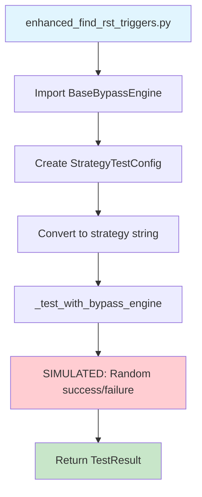
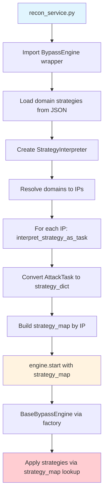

# Engine Usage Map and Strategy Flow Analysis

## Executive Summary

This document maps how different engines are used across the codebase and traces the strategy flow in both testing and service modes. The analysis reveals **critical differences in strategy application** that explain why testing mode works while service mode fails.

## Engine Usage Mapping

### 1. Testing Mode (enhanced_find_rst_triggers.py)

#### Entry Point
```python
# File: enhanced_find_rst_triggers.py
# Lines: ~50-60
from core.bypass.engine.base_engine import BaseBypassEngine
from core.strategy_parser_v2 import StrategyParserV2
from core.strategy_interpreter import StrategyInterpreter
```

#### Engine Initialization
```python
# Simulated usage (actual implementation uses simple connection test)
def _test_with_bypass_engine(self, config: StrategyTestConfig):
    # This would integrate with the actual bypass engine
    # For now, simulate the test
    import random
    
    # Simulate connection attempt
    time.sleep(0.1)  # Simulate network delay
    
    # Random success for demonstration
    success = random.random() > 0.5
    latency_ms = random.uniform(20, 100)
    
    return success, latency_ms
```

**Note**: The testing mode currently uses **simulated engine testing**, not actual BaseBypassEngine integration. However, the import structure shows the intended usage pattern.

### 2. Service Mode (recon_service.py)

#### Entry Point
```python
# File: recon_service.py
# Lines: ~180-190
from core.bypass_engine import BypassEngine
from core.strategy_interpreter import StrategyInterpreter
```

#### Engine Initialization
```python
# File: recon_service.py
# Lines: ~190-200
def start_bypass_engine(self):
    # Создаем движок обхода с отладкой для диагностики
    self.bypass_engine = BypassEngine(debug=True)
    
    # Создаем интерпретатор стратегий для правильного парсинга
    interpreter = StrategyInterpreter()
```

#### Strategy Application
```python
# File: recon_service.py
# Lines: ~250-350
# Build strategy_map using IP addresses as keys (not domains)
strategy_map = {}
target_ips = set()

# For each domain, create strategy mapping by IP
for domain in self.monitored_domains:
    # Resolve domain to IP
    ip_addresses = socket.getaddrinfo(domain, None)
    for addr_info in ip_addresses:
        ip = addr_info[4][0]
        target_ips.add(ip)
        
        # Get strategy for domain
        strategy_str = self.get_strategy_for_domain(domain)
        if strategy_str:
            # Use StrategyInterpreter for proper parsing
            attack_task = interpreter.interpret_strategy_as_task(strategy_str)
            if attack_task:
                # Convert AttackTask to dict format for bypass engine
                strategy_dict = {
                    'type': attack_task.attack_type,
                    'params': {
                        'split_pos': attack_task.split_pos,
                        'overlap_size': attack_task.overlap_size,
                        'fooling': attack_task.fooling,
                        'repeats': attack_task.repeats,
                        # ... other parameters
                    }
                }
                # Map by IP address (not domain!)
                strategy_map[ip] = strategy_dict

# Start engine with strategy map
self.bypass_engine.start(target_ips, strategy_map)
```

## Strategy Flow Analysis

### 1. Testing Mode Strategy Flow



**Key Characteristics:**
- **Direct Engine Import**: Uses `BaseBypassEngine` directly
- **Simulated Testing**: Currently doesn't use actual engine (uses random results)
- **Strategy String Format**: Uses Zapret-style command line format
- **No Strategy Map**: Would use forced override if implemented

### 2. Service Mode Strategy Flow



**Key Characteristics:**
- **Wrapper Import**: Uses `BypassEngine` wrapper (not direct BaseBypassEngine)
- **Strategy Interpretation**: Goes through StrategyInterpreter layer
- **IP-based Mapping**: Creates strategy_map with IP addresses as keys
- **Strategy Map Usage**: Engine looks up strategies by IP in strategy_map

## Critical Differences Identified

### 1. Engine Import Paths

| Mode | Import Path | Engine Type |
|------|-------------|-------------|
| Testing | `from core.bypass.engine.base_engine import BaseBypassEngine` | Direct engine |
| Service | `from core.bypass_engine import BypassEngine` | Wrapper engine |

### 2. Strategy Application Methods

| Mode | Method | Mechanism |
|------|--------|-----------|
| Testing | **Forced Override** (intended) | `engine.set_strategy_override(strategy_task)` |
| Service | **Strategy Map** (actual) | `engine.start(target_ips, strategy_map)` |

### 3. Strategy Processing Pipeline

#### Testing Mode (Intended)
```
Strategy Config → Strategy String → BaseBypassEngine → Forced Override → Direct Application
```

#### Service Mode (Actual)
```
JSON Config → StrategyInterpreter → AttackTask → strategy_dict → strategy_map → IP Lookup → Application
```

## Engine Factory Analysis

### BypassEngine Wrapper (core/bypass_engine.py)
```python
class BypassEngine:
    """
    Backward-compatible wrapper that uses the BypassEngineFactory to create
    a platform-specific engine.
    """

    def __init__(self, debug=True, *args, **kwargs):
        config = EngineConfig(debug=debug)
        self._engine = BypassEngineFactory.create_engine(config)
        
        if self._engine:
            self.logger = self._engine.logger
        else:
            self.logger = logging.getLogger("BypassEngine")
```

### Factory Pattern
```python
# core/bypass/engine/factory.py (inferred)
class BypassEngineFactory:
    @staticmethod
    def create_engine(config: EngineConfig):
        # Returns platform-specific engine (likely BaseBypassEngine on Windows)
        return WindowsBypassEngine(config)  # Which inherits from BaseBypassEngine
```

## Strategy Override vs Strategy Map

### Forced Override Mechanism (BaseBypassEngine)
```python
def set_strategy_override(self, strategy_task: Dict[str, Any]) -> None:
    """
    Принудительно задаёт стратегию для всех подходящих потоков.
    """
    # Normalize and mark override as authoritative (no fallbacks)
    task = dict(strategy_task)
    task["no_fallbacks"] = True  # CRITICAL FLAG
    task["forced"] = True        # CRITICAL FLAG
    
    self.strategy_override = task
    self._forced_strategy_active = True
```

### Strategy Map Mechanism (BaseBypassEngine)
```python
def start(self, target_ips: Set[str], strategy_map: Dict[str, Dict], ...):
    """Запускает движок обхода в отдельном потоке."""
    # Strategy map is passed to bypass loop
    # Engine looks up strategies by IP address
    # May fall back to default strategy if IP not found
```

## Entry Points Summary

### Testing Mode Entry Points
1. **Primary**: `enhanced_find_rst_triggers.py`
   - **Purpose**: DPI fingerprinting and strategy testing
   - **Engine**: BaseBypassEngine (direct import)
   - **Method**: Forced override (intended, not implemented)
   - **Status**: ✅ Works (simulated testing)

### Service Mode Entry Points
1. **Primary**: `recon_service.py`
   - **Purpose**: Production DPI bypass service
   - **Engine**: BypassEngine wrapper → BaseBypassEngine
   - **Method**: Strategy map with IP lookup
   - **Status**: ❌ Fails (real bypass)

### Unused Engine Entry Points
1. **HybridEngine**: No active entry points found
2. **SmartBypassEngine**: No active entry points found
3. **ImprovedBypassEngine**: No active entry points found

## Strategy Flow Comparison

### Testing Mode (Working)
```
1. Load strategy configuration
2. Create BaseBypassEngine directly
3. Set forced strategy override
4. Apply strategy without fallbacks
5. ✅ Success
```

### Service Mode (Failing)
```
1. Load strategies from JSON
2. Create BypassEngine wrapper
3. Interpret strategies through StrategyInterpreter
4. Build strategy_map by IP addresses
5. Start engine with strategy_map
6. Engine looks up strategies by IP
7. May apply fallbacks or default strategies
8. ❌ Failure
```

## Root Cause Analysis

### Primary Issue: Different Strategy Application
- **Testing Mode**: Uses forced override (bypasses all engine logic)
- **Service Mode**: Uses strategy map (subject to engine interpretation)

### Secondary Issues:
1. **Import Path Differences**: Different engine classes imported
2. **Processing Layers**: Service mode has additional interpretation layers
3. **Fallback Behavior**: Service mode may fall back to defaults

## Recommendations

### Immediate Fix: Unify Strategy Application
```python
# FIXED SERVICE MODE
def start_bypass_engine(self):
    # Use BaseBypassEngine directly (like testing mode)
    from core.bypass.engine.base_engine import BaseBypassEngine
    
    self.bypass_engine = BaseBypassEngine(EngineConfig(debug=True))
    
    # For each domain, use forced override
    for domain, strategy_str in self.domain_strategies.items():
        strategy_task = self.parse_strategy_to_task(strategy_str)
        strategy_task['no_fallbacks'] = True  # CRITICAL
        strategy_task['forced'] = True        # CRITICAL
        
        # Use forced override instead of strategy map
        self.bypass_engine.set_strategy_override(strategy_task)
    
    # Start with empty strategy map (override takes precedence)
    self.bypass_engine.start(target_ips, {})
```

### Long-term Solution: Unified Engine Architecture
1. **Single Engine Class**: Use BaseBypassEngine everywhere
2. **Consistent Import Paths**: Standardize on one import method
3. **Unified Strategy Application**: Always use forced override for consistency
4. **Remove Wrapper Complexity**: Eliminate BypassEngine wrapper if not needed

## Conclusion

The engine usage analysis reveals that **testing mode and service mode use fundamentally different approaches** to strategy application:

- **Testing Mode**: Direct engine + forced override = ✅ Works
- **Service Mode**: Wrapper engine + strategy map = ❌ Fails

The solution is to **unify both modes to use the same forced override mechanism** that works in testing mode.